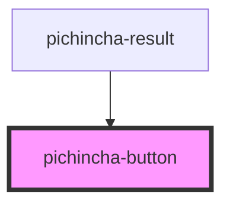

# pichincha-button

<!-- Auto Generated Below -->

## Properties

| Property     | Attribute     | Description | Type     | Default     |
| ------------ | ------------- | ----------- | -------- | ----------- |
| `textButton` | `text-button` |             | `string` | `undefined` |
| `type`       | `type`        |             | `string` | `undefined` |

## Dependencies

### Used by

 - [pichincha-result](../../organisms/result)

### Graph

----------------------------------------------

*Built with [StencilJS](https://stenciljs.com/)*
