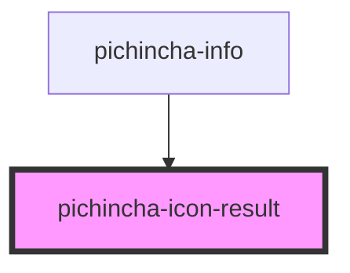

# pichincha-icon-result

<!-- Auto Generated Below -->

## Properties

| Property | Attribute | Description | Type                   | Default     |
| -------- | --------- | ----------- | ---------------------- | ----------- |
| `size`   | `size`    |             | `string`               | `undefined` |
| `type`   | `type`    |             | `"error" \| "success"` | `'success'` |

## Dependencies

### Used by

 - [pichincha-info](../../molecules/info)

### Graph

----------------------------------------------

*Built with [StencilJS](https://stenciljs.com/)*
