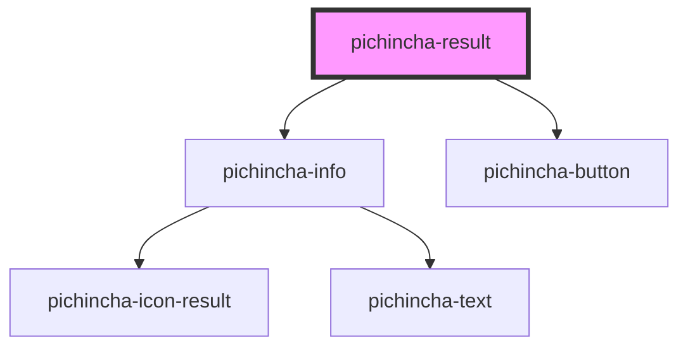

# pichincha-result

<!-- Auto Generated Below -->

## Properties

| Property        | Attribute        | Description | Type                   | Default     |
| --------------- | ---------------- | ----------- | ---------------------- | ----------- |
| `cancel`        | `cancel`         |             | `string`               | `undefined` |
| `done`          | `done`           |             | `string`               | `undefined` |
| `primaryText`   | `primary-text`   |             | `string`               | `undefined` |
| `secondaryText` | `secondary-text` |             | `string`               | `undefined` |
| `size`          | `size`           |             | `string`               | `undefined` |
| `type`          | `type`           |             | `"error" \| "success"` | `undefined` |

## Dependencies

### Depends on

- [pichincha-info](../../molecules/info)
- [pichincha-button](../../atoms/button)

### Graph

----------------------------------------------

*Built with [StencilJS](https://stenciljs.com/)*
